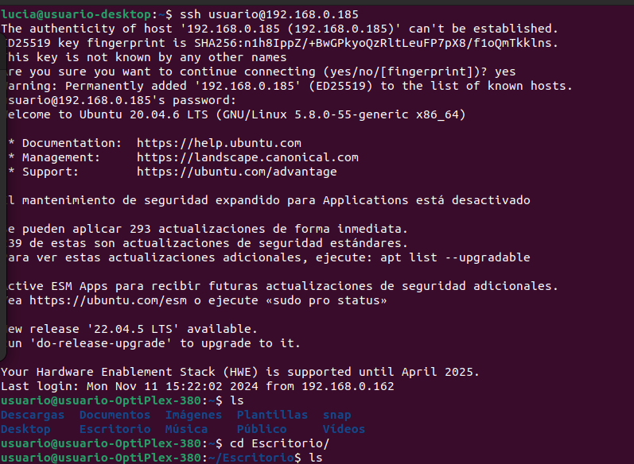
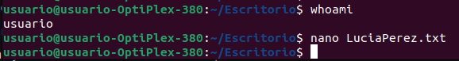
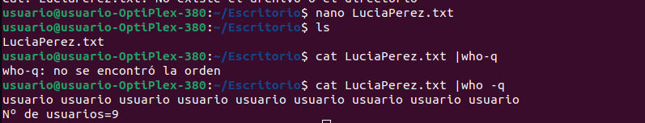

## Ejercicio 2
Primero, debemos acceder a la máquina remota mediante ssh:

Luego, nos dirigimos al escritorio y creamos un archivo de texto que dentro tendrá el resultado de _whoami_ que es **usuario**.

Luego mediante el comando _cat_ y _who -q_ comprobaremos quienes están conectados y el número total de usuarios.

Y luego que hayamos acabado todo, ponemos el comando _exit_ el cuál saldrá de la máquina remota.

## Ejercicio 3
