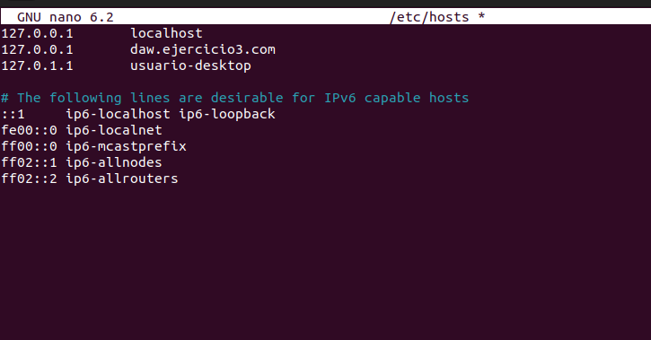

## Ejercicio 2
Primero, debemos acceder a la máquina remota mediante ssh:

Luego, nos dirigimos al escritorio y creamos un archivo de texto que dentro tendrá el resultado de _whoami_ que es **usuario**.

Luego mediante el comando _cat_ y _who -q_ comprobaremos quienes están conectados y el número total de usuarios.

Y luego que hayamos acabado todo, ponemos el comando _exit_ el cuál saldrá de la máquina remota.

## Ejercicio 3

Ubuntu inicia Apache. El servidor web ya debería estar activo. Debemos iniciar el servidor web y realizar una verificación con _systemd_ para saber si está en ejecución el servicio

Para configurar el archivo VirtualHost, primero navega al directorio de archivos de configuración: _cd /etc/apache2/sites-available/_

Usar el archivo VirtualHost predeterminado como base: _sudo cp 000-default.conf gci.conf_

Luego tenemos que editar el archivo de configuracion: _sudo nano gci.conf_

Hay que crear el directorio para _daw.ejercicio3.com_, debemos conceder permisos de lectura y ejecución a los grupos y terceros. A continuación, creamos nuestro html utilizando _nano index.html_. 
Necesitaremos crear un archivo de host virtual con las directivas correctas en _daw.ejercicio3.com.conf_.
Debemos actualizar nuestro nuevo directorio y nombre de dominio

Luego debemos habilitar el archivo con la herramienta _a2ensite_, deshabilitar el sitio predeterminado en _000-default.conf_ y comprobar que no haya errores. Reiniciamos Apache para implementar todos los cambios y cuando pongamos _daw.ejercicio3.com_ en nuestro navegador, nos saldrá el contenido de index.html.

No sin antesir al archivo _/etc/hosts_ y añadir la segunda línea para asignar la IP al subdominio:

